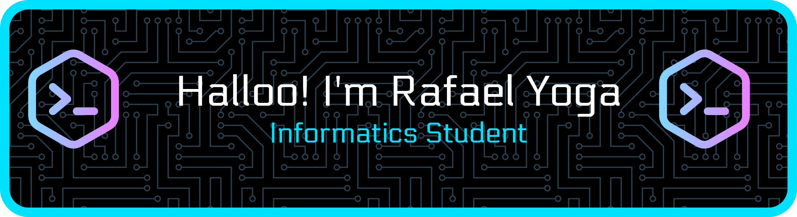

### About Me
Hello, my name is Rafael Yoga. I am an Informatics student who has a strong interest in technology, programming, and web development. I enjoy learning how software works and exploring new tools that help me improve my programming skills.  I like building small projects to practice my skills and gain practical experience. My goal is to continue developing my abilities and become a skilled software developer who can create useful and impactful digital solutions in the future. 🚀
### Skills

### Connect With Me!
[![https://instagram.com/rafaelyg_]](https://img.shields.io/badge/Instagram-E4405F?style=for-the-badge&logo=instagram&logoColor=white)
<!--
**rafaelyb9/rafaelyb9** is a ✨ _special_ ✨ repository because its `README.md` (this file) appears on your GitHub profile.

Here are some ideas to get you started:

- 🔭 I’m currently working on ...
- 🌱 I’m currently learning ...
- 👯 I’m looking to collaborate on ...
- 🤔 I’m looking for help with ...
- 💬 Ask me about ...
- 📫 How to reach me: ...
- 😄 Pronouns: ...
- ⚡ Fun fact: ...
-->
